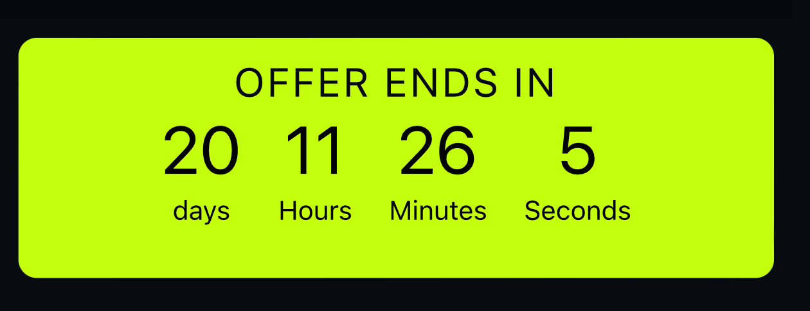
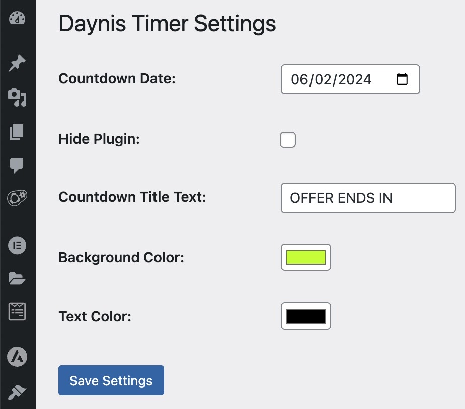

# Daynis Countdown Timer Plugin

The **Daynis Countdown Timer** is a simple and customizable WordPress plugin that allows you to display a countdown timer on your website. You can use this plugin to create countdowns for various events, promotions, or offers. The timer can be easily configured through the WordPress admin panel, making it a versatile tool for engaging your website visitors.

## Features

- **Countdown Timer:** Display a countdown timer on your website to create a sense of urgency and excitement for your visitors.

- **Customizable:** Customize the countdown date, background color, text color, and countdown title text to match your website's design and style.

- **Settings Page:** Easily configure the plugin settings through the WordPress admin panel.

- **Shortcode:** Use the `[daynis-timer]` shortcode to insert the countdown timer into any post or page on your website.

- **Option to Hide:** Hide the countdown timer by enabling the "Hide Plugin" option in the settings.

## Screenshots

### Frontend

*Caption: The countdown timer displayed on the frontend of your website.*

### Settings screen

*Caption: The plugin settings page in the WordPress admin panel.*

## Installation

1. Download the plugin ZIP file.

2. In your WordPress admin panel, go to "Plugins" -> "Add New."

3. Click the "Upload Plugin" button at the top of the page.

4. Choose the downloaded ZIP file and click "Install Now."

5. Activate the plugin through the "Plugins" menu in WordPress.

## Usage

1. After activating the plugin, navigate to "Settings" -> "Daynis Timer" in the WordPress admin panel.

2. Configure the countdown date, background color, text color, countdown title text, and hide plugin option according to your preferences.

3. Save your settings.

4. Use the `[daynis-timer]` shortcode in any post or page where you want to display the countdown timer.

## Customisation

- To change the countdown date, go to the plugin settings page in the WordPress admin panel.

- To customize the countdown title text, background color, and text color, visit the plugin settings as well.

## License

This plugin is released under the [GPLv2 or later](https://www.gnu.org/licenses/gpl-2.0.html) license.

